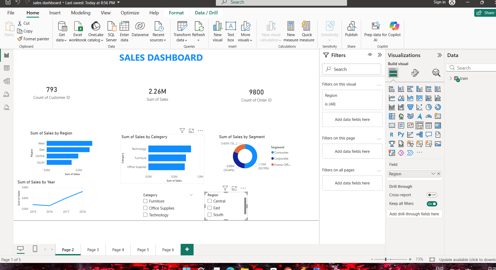

# 📊 Sales Performance Dashboard — Power BI

> An end-to-end interactive BI dashboard built on the Superstore dataset, tracking revenue, profit, and growth across product categories and regions.

---

## 🔍 Project Overview

This project demonstrates a complete Business Intelligence reporting workflow — from raw CSV data to a fully interactive Power BI dashboard. It was built to simulate the kind of sales reporting a data or MIS analyst would deliver in a business environment.

---

## 🛠️ Tools & Technologies

| Tool | Usage |
|------|-------|
| Power BI Desktop | Dashboard design, DAX, visualizations |
| Microsoft Excel | Initial data inspection and cleaning |
| DAX (Data Analysis Expressions) | KPI calculations and dynamic measures |
| Superstore Dataset | Source data (publicly available) |

---

## 📌 Key Features

- **3 Dynamic KPIs** — Total Revenue, Total Profit, Year-over-Year Growth %
- **6+ Visual Components** — KPI cards, bar charts, donut charts, line charts
- **Interactive Slicers** — Filter by Region, Category, and Time Period
- **DAX Measures** — YoY growth %, profit margin, and cumulative sales
- **Category Breakdown** — Performance tracked across 4 product categories

---

## 📈 Dashboard Sections

1. **Overview Panel** — High-level KPIs at a glance
2. **Sales Trends** — Monthly line chart showing revenue over time
3. **Category Analysis** — Bar and donut charts by product category
4. **Regional Performance** — Profit and sales split by region
5. **Filter Panel** — Dynamic slicers for drill-down analysis

---

## 💡 What I Learned

- Writing DAX measures for time intelligence (YoY, MTD)
- Designing dashboards with a clear visual hierarchy
- Connecting raw CSV data to Power BI and building a data model
- Creating reusable report templates for business stakeholders

---

## 📂 Files in This Repository

```
├── Sales_Dashboard.pbix        # Power BI report file
├── superstore_data.csv         # Source dataset
├── dashboard_screenshot.png    # Preview image
└── README.md
```

---

## 🖼️ Dashboard Preview

> 



---

## 📬 Connect

**Adithyan L J**  
📧 ljadithyan@gmail.com  
🔗 [LinkedIn](https://www.linkedin.com/in/adithyan-lj-378181332)  
💻 [GitHub](https://github.com/ljadithyan-boop)

---

> *Built as part of my Data Analyst portfolio — BCA Final Year, IZEE Business School, Bengaluru*
